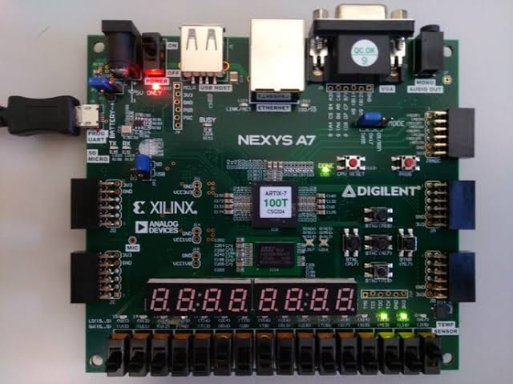
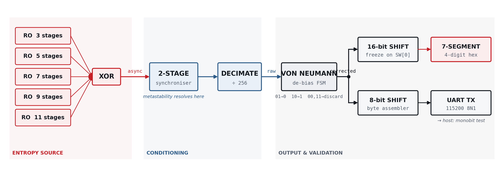
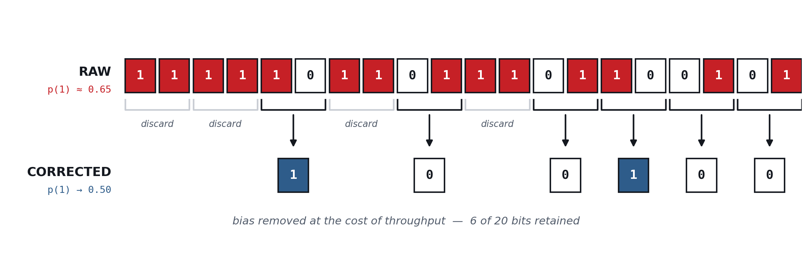

# artix7-ring-oscillator-trng
A true random number generator built from ring oscillators on a Xilinx Artix-7 FPGA — no external components, validated against the full NIST SP 800-22 battery.
# Ring-Oscillator True Random Number Generator on Artix-7

**A hardware entropy source built entirely from general-purpose FPGA logic — no external components, no analog parts.**

Five free-running ring oscillators, XOR-combined and deliberately driven into metastability, de-biased in hardware with a Von Neumann corrector, and validated against the full NIST SP 800-22 statistical test suite.

> *The number on the display isn't calculated. It's measured.*

---

## Why this exists

A pseudorandom generator is a formula: same seed, same output, forever. Every key, nonce, and session token that depends on one is only as unpredictable as its seed. To get a value nobody could predict in advance, you have to stop computing and measure something physical instead. This project measures thermal noise inside the FPGA's own silicon, using nothing but the chip's general-purpose logic fabric.

## Results

Measured on a Digilent Nexys A7-100T (XC7A100T-1CSG324C), Vivado 2018.2:

| | |
|---|---|
| **Bits captured** | 1,228,280 |
| **Ones / zeros** | 613,985 / 614,295 |
| **Measured p(1)** | 0.4999 |
| **Monobit S / P-value** | 0.2797 / **0.7797** |
| **Monobit verdict (α = 0.01)** | **PASS** |
| **Full NIST SP 800-22 battery** | **7 / 15 passed** |
| **Slice LUTs / Registers** | 95 / 144 (of 63,400 / 126,800) |

The 7 passing tests are exactly the tests sensitive to bit-level balance (Monobit, Frequency Within Block, Runs, Longest Run, Binary Matrix Rank, Non-Overlapping Template Matching, Cumulative Sums). The 8 that fail are exactly the tests designed to detect periodicity and structural correlation (Spectral/DFT, Serial, Approximate Entropy, Linear Complexity, Random Excursions, Overlapping Template, Maurer's Universal) — expected, and explained below, not a defect. Full per-test table and discussion: [`docs/reports/TRNG_IEEE_Report.pdf`](docs/reports/TRNG_IEEE_Report.pdf).



## How it works

1. **Five ring oscillators** (3, 5, 7, 9, 11 inverting stages) free-run at different, unrelated speeds — an odd number of inverters in a loop has no stable state, so each just keeps flipping on its own.
2. **XOR-combined** into one signal, then sampled by a flip-flop on the 100 MHz system clock. Because the oscillators and the clock share no relationship, the sample occasionally lands mid-transition, driving the flip-flop into **metastability** — an unstable state resolved by real thermal noise, not logic. A second flip-flop gives that resolution a full clock period to settle before anything downstream trusts it.
3. **Decimated ÷256** — only 1 sample in 256 is kept, since adjacent samples 10 ns apart are too correlated to count as independently random.
4. **Von Neumann corrector**: reads the stream two bits at a time, keeps disagreeing pairs (01→0, 10→1), discards agreeing pairs (00, 11). Removes first-order bias exactly, for any input bias, at a retention cost of R = 2p(1−p).
5. Output fans out to a **7-segment display** (freeze on a switch, blurs otherwise) and a **UART link** (115200 8N1) to a host for statistical validation.



## What this is, and isn't

**Is:** a working demonstration of a physical entropy source, correctly conditioned, with measured statistical evidence and an honestly stated scope.

**Isn't:** NIST SP 800-90B certified. Not proof the five oscillators are independent (they share one die and one supply rail — decorrelated, not independent). Not a deployable security product.

## Repository layout

```
rtl/                  6 Verilog modules (~530 lines total)
  ring_osc.v            one ring oscillator (LUT1 primitives, dont_touch)
  entropy_source.v       5 rings + XOR + 2-stage synchroniser + decimation
  von_neumann.v          bias-correcting FSM
  seven_seg_ctrl.v       7-segment display driver (freeze switch, hex decode)
  uart_tx.v               115200 8N1 UART transmitter
  trng_top.v              top-level wiring
sim/
  trng_tb.v              testbench (Von Neumann, UART, display — not the RO itself; see note below)
constraints/
  nexys_a7.xdc           pin mapping (verified against Digilent's official master XDC)
                         + the 4 lines specific to this design's intentional combinational loop
scripts/
  host/verify.py         captures UART output, runs a monobit test
  gui/trng_analyzer_gui.py   Tkinter GUI: capture + full NIST SP 800-22 battery + PDF report
docs/
  figures/               architecture diagrams
  reports/                full IEEE-format report (PDF), poster (PDF), slide deck (PDF)
demonstartion/           Video_file,GUI Visulaization etc.
```

## Building it

1. Vivado → Create Project → RTL Project → board: **Nexys A7-100T**.
2. Add all six files in `rtl/` as design sources.
3. Add `constraints/nexys_a7.xdc` as constraints.
4. Add `sim/trng_tb.v` as a simulation source — **set it as top for simulation only** (`trng_top` stays top for synthesis/implementation; these are two independent settings in Vivado).
5. Run behavioral simulation first. Note: ring oscillators don't oscillate in plain simulation (no real gate delay), so the testbench uses a stand-in LFSR to exercise everything downstream of the entropy source.
6. Synthesize — expect `LUTLP-1` combinational-loop **warnings** (that's the oscillators, intentional). Implement, generate bitstream, program.
7. On hardware: LED[15] blinks as a heartbeat, the display blurs while running, freeze it with `SW[0]`.
8. Validate: `pip install pyserial nistrng numpy fpdf`, then run `scripts/gui/trng_analyzer_gui.py` for the full NIST battery with an auto-generated PDF report, or `scripts/host/verify.py` for a quick monobit check.

## Tools

Vivado 2018.2 · Verilog-2001 · Python 3 (pyserial, nistrng, numpy, fpdf)

## License

MIT — see [`LICENSE`](LICENSE).

## Author

Muhammad Saad Bin Waqas — Ghulam Ishaq Khan Institute of Engineering Sciences and Technology
